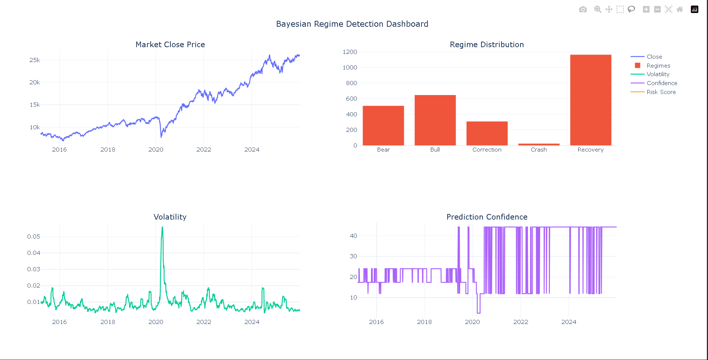
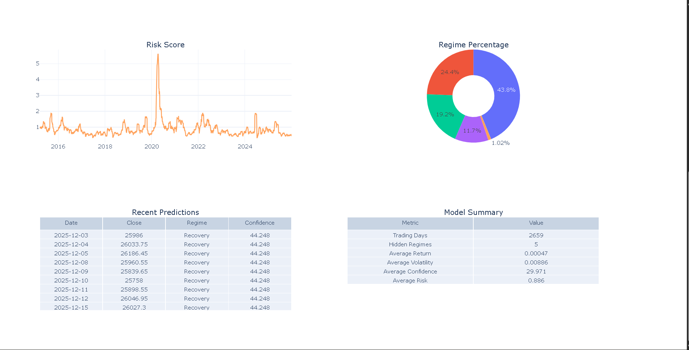

# 📈 Bayesian Regime Detection Engine for Equity Direction Forecasting

A production-style Machine Learning project that detects hidden market regimes in the Indian equity market using Bayesian methods, Hidden Markov Models (HMM), Ensemble Learning, and Conformal Prediction.

This project is inspired by quantitative finance workflows used in asset management and algorithmic trading for market regime analysis and risk-aware forecasting.

---

# 🚀 Project Overview

Financial markets continuously switch between different hidden market conditions such as:

- Bull Market
- Bear Market
- High Volatility
- Low Volatility
- Sideways Market

Traditional models assume the market behaves similarly over time.

This project instead identifies hidden market regimes using probabilistic models and generates uncertainty-aware predictions.

---

# 🎯 Objectives

- Detect hidden market regimes
- Learn transition probabilities between regimes
- Estimate uncertainty using Bayesian inference
- Improve prediction robustness using Ensemble Learning
- Quantify prediction reliability using Conformal Prediction
- Generate professional visualizations and interactive dashboards

---

# 🏗 Project Architecture

```
                 NIFTY-50 Data
                       │
                       ▼
                Data Preprocessing
                       │
                       ▼
             Feature Engineering
                       │
                       ▼
              Hidden Markov Model
                       │
                       ▼
               Bayesian Inference
                       │
                       ▼
              Ensemble Prediction
                       │
                       ▼
           Conformal Prediction
                       │
                       ▼
             Evaluation & Reports
                       │
                       ▼
       Visualization + Dashboard
```

---

# 📂 Project Structure

```text
Bayesian_Regime_Detection/

├── data/
│   ├── raw/
│   └── processed/
│
├── models/
│   └── trained/
│
├── outputs/
│   ├── figures/
│   ├── reports/
│   └── dashboard/
│
├── src/
│   ├── config.py
│   ├── logger.py
│   ├── data_loader.py
│   ├── preprocess.py
│   ├── feature_engineering.py
│   ├── hmm_model.py
│   ├── bayesian_model.py
│   ├── ensemble.py
│   ├── conformal.py
│   ├── evaluator.py
│   ├── visualization.py
│   ├── dashboard.py
│   └── pipeline.py
│
├── logs/
├── requirements.txt
├── README.md
└── main.py


# 🛠 Tech Stack

- Python 3.x
- Pandas
- NumPy
- Scikit-Learn
- hmmlearn
- SciPy
- Matplotlib
- Plotly
- Joblib
- Loguru
- yFinance

---

# ⭐ Key Features

- Automated NIFTY-50 Data Collection
- Data Cleaning & Preprocessing
- Advanced Feature Engineering
- Hidden Markov Model (HMM)
- Bayesian Probability Estimation
- Ensemble Regime Prediction
- Conformal Prediction for Uncertainty Quantification
- Evaluation Report Generation
- Interactive Dashboard
- Professional Logging System
- Modular Project Architecture

---

# ⚙ Installation

Clone the repository

```bash
git clone https://github.com/yourusername/Bayesian_Regime_Detection.git
```

Move into the project directory

```bash
cd Bayesian_Regime_Detection
```

Create virtual environment

```bash
python -m venv venv
```

Activate environment

Windows

```bash
venv\Scripts\activate
```

Linux / Mac

```bash
source venv/bin/activate
```

Install dependencies

```bash
pip install -r requirements.txt
```

---

# ▶ Run Project

```bash
python main.py
```

---

# 📊 Output Files

The project automatically generates:

```
data/processed/

feature_data.csv

regime_data.csv

bayesian_predictions.csv

ensemble_predictions.csv

conformal_predictions.csv
```

```
models/trained/

gaussian_hmm.pkl

feature_scaler.pkl
```

```
outputs/

figures/

reports/

dashboard/dashboard.html
```

---

# 📈 Visualizations

The project creates:

- Hidden Market Regimes
- Volatility Trend
- Prediction Confidence
- Return Distribution
- Interactive Dashboard

---

# 📑 Evaluation

The evaluation module generates:

- Regime Distribution
- Risk Summary
- Confidence Summary
- Coverage Summary

---

# 💡 Applications

- Algorithmic Trading
- Quantitative Finance
- Portfolio Management
- Risk Management
- Financial Forecasting
- Market Regime Detection
- Research & Development

---

# 🔮 Future Improvements

- Bayesian Deep Learning
- Foundation Models Integration
- Sequential Monte Carlo
- Regime Switching VAR
- Topological Data Analysis
- Real-time Streaming Pipeline
- Cloud Deployment

---

# 👨‍💻 Author

**Md Mokarram Ali**

Data Analyst | Data Engineer | Machine Learning Enthusiast

---

# ⭐ If you found this project useful

Please consider giving this repository a ⭐ on GitHub.


# DASHBOARD





Last updated
